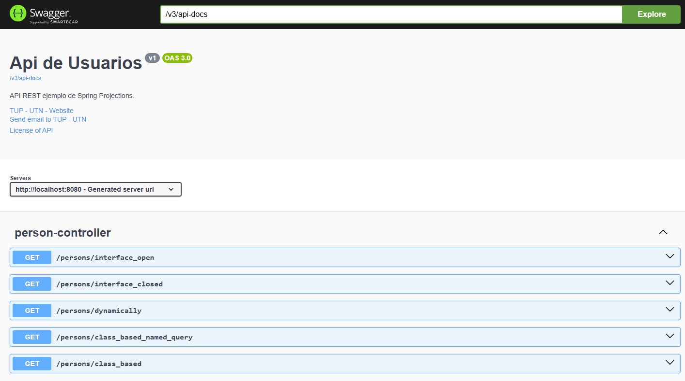
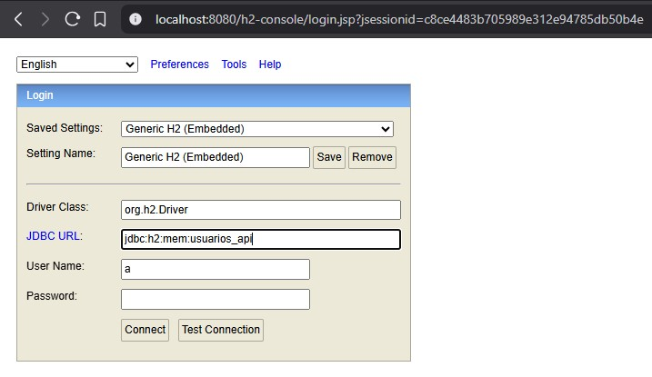
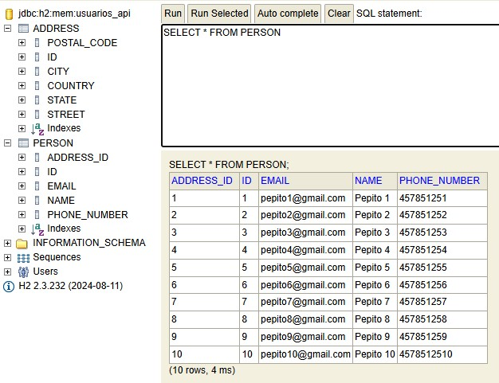
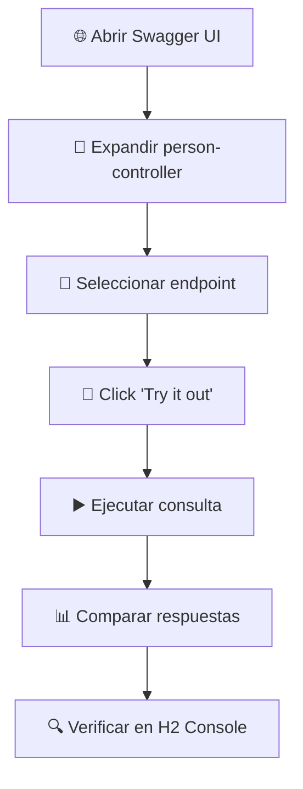
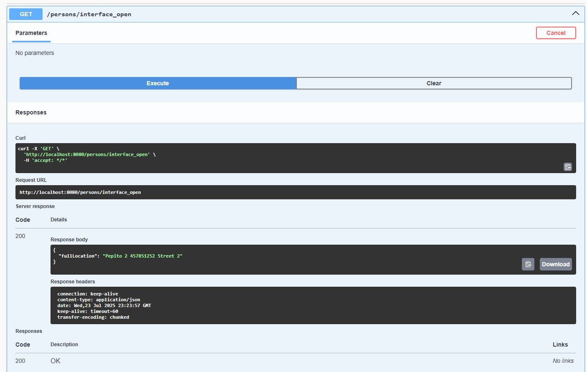
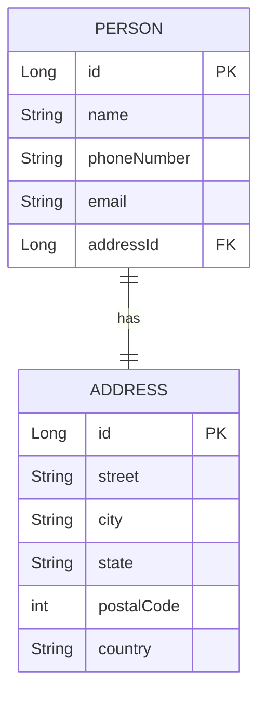

# 🌱 Spring Projections Demo

<div align="center">


</div>

## 📋 Descripción del Proyecto

Este proyecto demuestra el uso de **proyecciones en Spring Data JPA** para optimizar las consultas a la base de datos y devolver solo los datos necesarios. El proyecto implementa diferentes tipos de proyecciones utilizando una entidad `Person` 👤 con su respectiva dirección (`Address`) 🏠.

---

## 🛠️ Tecnologías Utilizadas

<table>
  <tr>
    <td align="center">
      
      <br><b>Spring Boot 3.5.3</b>
    </td>
    <td align="center">
      
      <br><b>Java 17</b>
    </td>
    <td align="center">
      
      <br><b>Spring Data JPA</b>
    </td>
    <td align="center">
      
      <br><b>H2 Database</b>
    </td>
  </tr>
  <tr>
    <td align="center">
      
      <br><b>Lombok</b>
    </td>
    <td align="center">
      
      <br><b>Swagger/OpenAPI</b>
    </td>
    <td align="center">
      
      <br><b>Maven</b>
    </td>
  </tr>
</table>

---

## 🎯 Tipos de Proyecciones Implementadas

El proyecto demuestra diferentes enfoques para trabajar con proyecciones:

### 1. 🔓 **Proyección de Interfaz Abierta** (`PersonFullLocation`)
- ✨ Utiliza `@Value` con SpEL para combinar campos
- 🔗 Retorna una cadena concatenada con nombre, teléfono y calle

### 2. 🔒 **Proyección de Interfaz Cerrada** (`PersonLocation`)
- 🎯 Expone solo los métodos específicos necesarios
- 📝 Campos: name, phoneNumber, street

### 3. 🏗️ **Proyección Basada en Clase** (`PersonLocationDTO`)
- 🧩 Utiliza `Tuple` para mapear resultados
- ⚙️ Constructor manual en el controlador

### 4. 📊 **Proyección con Named Query** (`PersonLocationDTO2`)
- 🗃️ Usa `@NamedNativeQuery` y `@SqlResultSetMapping`
- 🔄 Mapeo automático a constructor

### 5. 🎪 **Proyección Dinámica**
- 🚀 Permite especificar el tipo de proyección en tiempo de ejecución

---

## 🚀 Instrucciones de Uso

### 1. ▶️ Ejecutar el Proyecto

```bash
# 🐧 Usando Maven Wrapper (Linux/Mac)
./mvnw spring-boot:run

# 🪟 Usando Maven Wrapper (Windows)
mvnw.cmd spring-boot:run

# 📦 O usando Maven instalado
mvn spring-boot:run
```

### 2. 🎬 Inicialización Automática

Al ejecutar el proyecto:
- ✅ Se crea automáticamente la base de datos H2 en memoria
- ✅ Se cargan datos genéricos de prueba con PopulatorTest
- 🌟 Aplicación lista en puerto `8080`

### 3. 🛠️ Herramientas de Desarrollo

#### 📚 Swagger UI (Documentación y Pruebas de API)

> 💡 **¿Por qué usar Swagger?**
> - 📖 Ver la documentación completa de la API
> - 🧪 Probar todos los endpoints de proyecciones
> - ✅ Verificar las respuestas de cada tipo de proyección

**🔗 URL:** [http://localhost:8080/swagger-ui/index.html](http://localhost:8080/swagger-ui/index.html)



#### 🗄️ Consola H2 (Base de Datos)

> 📊 **Datos de conexión:**
> - **JDBC URL:** `jdbc:h2:mem:usuarios_api`
> - **👤 Usuario:** `a`
> - **🔑 Contraseña:** `a`

**🔗 URL:** [http://localhost:8080/h2-console](http://localhost:8080/h2-console)

<details>
<summary>🖼️ Ver capturas de pantalla</summary>


*Pantalla de login de H2 Console*


*Vista de la base de datos*

</details>

### 4. 🛣️ Endpoints Disponibles

El controlador `PersonController` expone los siguientes endpoints en `/persons`:

| 🌐 Endpoint | 🔧 Método | 📝 Descripción | 🎯 Tipo de Proyección |
|-------------|-----------|----------------|----------------------|
| 🔓 `/interface_open` | `GET` | Proyección de interfaz abierta | `PersonFullLocation` |
| 🔒 `/interface_closed` | `GET` | Proyección de interfaz cerrada | `PersonLocation` |
| 🏗️ `/class_based` | `GET` | Proyección basada en clase | `PersonLocationDTO` |
| 📊 `/class_based_named_query` | `GET` | Proyección con named query | `PersonLocationDTO2` |
| 🎪 `/dynamically` | `GET` | Proyección dinámica | Configurable |

### 5. 🧪 Realizar Pruebas

<div align="center">



</div>

1. **🌐 Abrir Swagger UI** → `http://localhost:8080/swagger-ui/index.html`
2. **📂 Expandir** la sección `person-controller`
3. **🎯 Seleccionar** cualquier endpoint de proyección
4. **🧪 Hacer clic en "Try it out"**
5. **▶️ Ejecutar** la consulta y comparar las respuestas
6. **🔍 Verificar** en H2 Console las consultas SQL generadas


*Ejemplo de respuesta del endpoint interface_open*

---

## 🏗️ Estructura del Proyecto

```
🌱 Spring_projections/
├── 📁 src/
│   └── 📁 main/
│       ├── ☕ java/
│       │   └── 📦 com/pp/spring_projections/
│       │       ├── 🚀 SpringProjectionsApplication.java
│       │       ├── 🎮 controller/
│       │       │   └── 👥 PersonController.java
│       │       ├── ⚙️ service/
│       │       │   ├── 📋 PersonService.java
│       │       │   └── 🔧 impl/
│       │       │       └── ⚡ PersonServiceImpl.java
│       │       └── 🗄️ persistence/
│       │           ├── 🏗️ entity/
│       │           │   ├── 🏠 Address.java
│       │           │   └── 👤 Person.java
│       │           ├── 🎯 projections/
│       │           │   ├── 🔓 PersonFullLocation.java    # Interfaz abierta
│       │           │   ├── 🔒 PersonLocation.java        # Interfaz cerrada
│       │           │   ├── 🏗️ PersonLocationDTO.java     # Clase DTO
│       │           │   └── 📊 PersonLocationDTO2.java    # DTO con Named Query
│       │           └── 📚 repository/
│       │               ├── 🏠 AddressRepository.java
│       │               └── 👥 PersonRepository.java
│       └── 📄 resources/
│           └── ⚙️ application.yml
├── 📦 pom.xml
└── 📖 README.md
```

---

## 📊 Modelo de Datos

<div align="center">



</div>

### 👤 Entidad Person
- 🆔 `id`: Long (PK, auto-generado)
- 📝 `name`: String
- 📱 `phoneNumber`: String
- 📧 `email`: String
- 🏠 `addressId`: Long (FK hacia Address)

### 🏠 Entidad Address
- 🆔 `id`: Long (PK, auto-generado)
- 🛣️ `street`: String
- 🌆 `city`: String
- 🏛️ `state`: String
- 📮 `postalCode`: int
- 🌍 `country`: String

---

## 📋 Ejemplos de Respuesta

### 🔒 Proyección Cerrada (PersonLocation)
```json
{
  "name": "Juan Pérez",
  "phoneNumber": "123456789",
  "street": "Av. Principal 123"
}
```

### 🔓 Proyección Abierta (PersonFullLocation)
```json
{
  "fullLocation": "Juan Pérez  123456789  Av. Principal 123"
}
```

---

## ⭐ Características Principales

<div align="center">

| 🚀 Característica | 📝 Descripción |
|-------------------|----------------|
| **🎯 Optimización de consultas** | Las proyecciones permiten seleccionar solo los campos necesarios |
| **🔄 Flexibilidad** | Múltiples tipos de proyecciones para diferentes casos de uso |
| **📚 Documentación automática** | Swagger UI integrado para pruebas |
| **💾 Base de datos en memoria** | H2 para desarrollo y pruebas rápidas |
| **🧪 Datos de prueba** | Carga automática de datos para testing |

</div>

---

